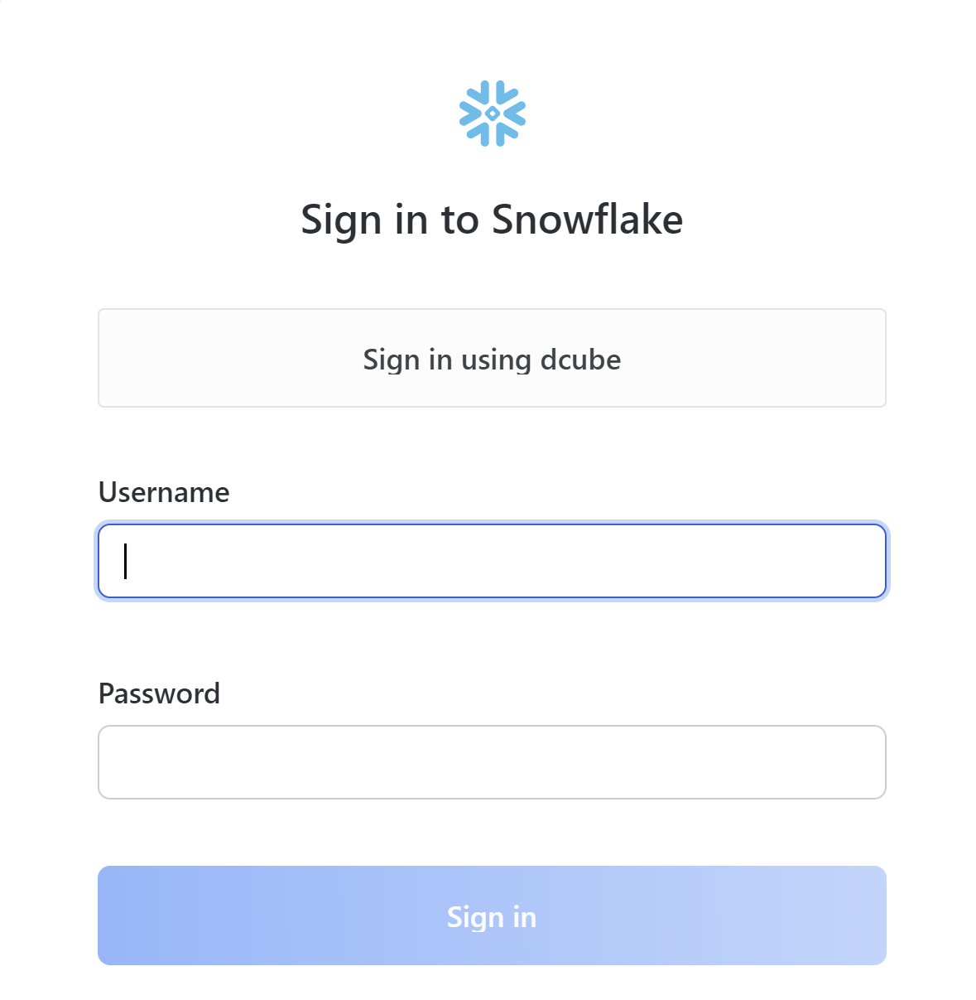
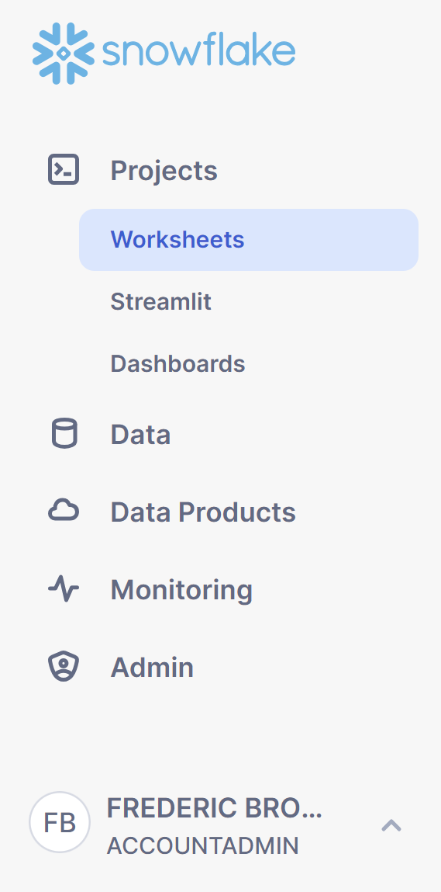
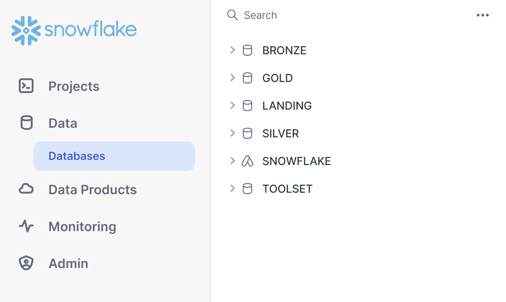
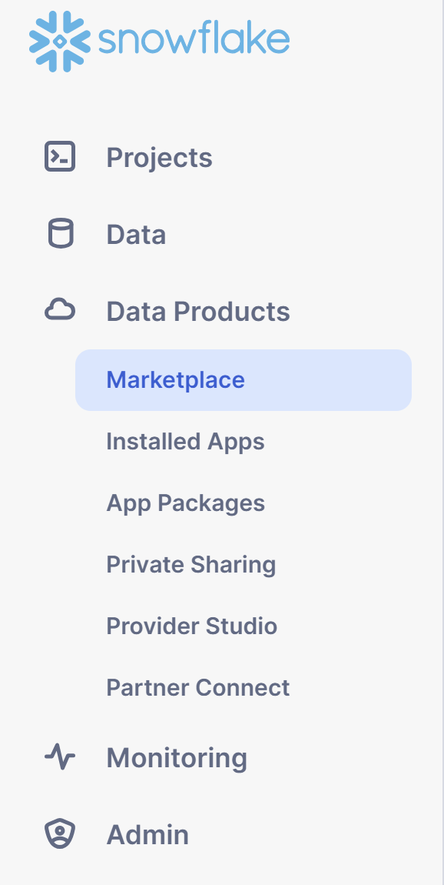
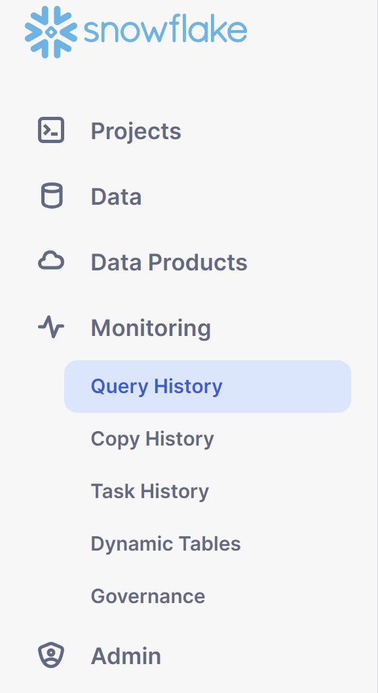
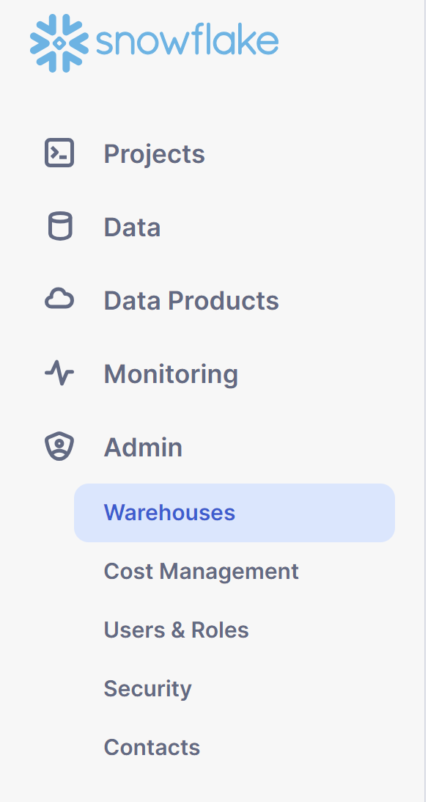
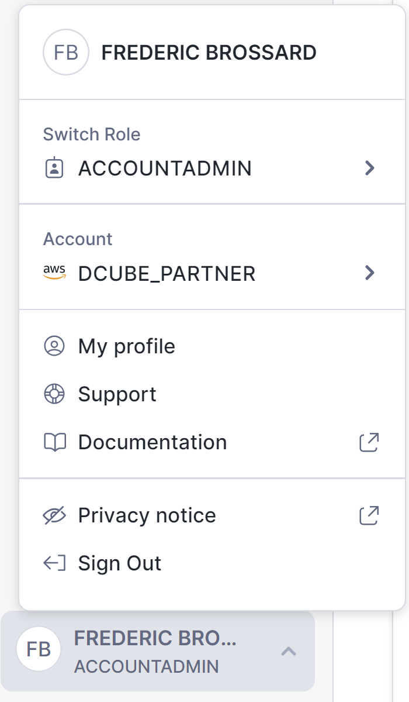
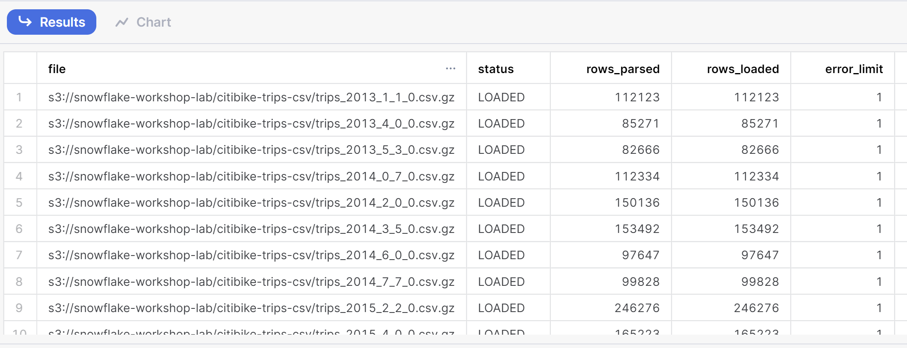
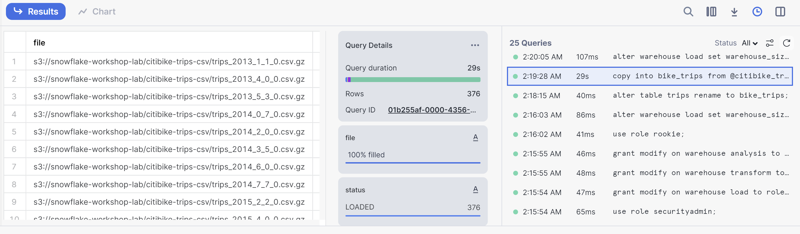

# dcubeLearning-87-zero-to-snowflae
Hands-on lab to introduce Snowflake basic concepts

## Prerequisites
- Basic knowledge of SQL, database concepts, and objects
- Familiarity with CSV comma-delimited files and JSON semi-structured data

## What You'll Learn:
- How to create roles and users, and grant them privileges.
- How to create stages, databases, tables, views, and virtual warehouses.
- How to load structured and semi-structured data.
- How to perform analytical queries on data in Snowflake, including joins between tables.
- How to clone objects.
- How to undo user errors using Time Travel.

# 1. Create the database, roles and grant privileges
Create the database learn_zero_to_snow \
N.B : you must have sysadmin and securityadmin roles to operate the following queries

```sql
-- ----------------------------------------------------------------------------
-- create the database for the learning
-- ----------------------------------------------------------------------------
use role sysadmin;
create database if not exists learn_zero_to_snow;

-- ----------------------------------------------------------------------------
-- create roles for the learning
-- ----------------------------------------------------------------------------
use role securityadmin;

-- create "business" role for attendees
create role if not exists rookie;
-- rookie role inheritance to sysadmin
grant role rookie to role sysadmin;
-- allow usage on warehouse to the rookie role
grant modify on warehouse load to role rookie;
grant modify on warehouse transform to role rookie;
grant modify on warehouse analysis to role rookie;

-- create "technical" role to define access privilege onto the learning database
create role if not exists learn_zero_to_snow_n0;
-- learn_zero_to_snow_n0 role inheritance to rookie
grant role learn_zero_to_snow_n0 to role rookie;

-- give ownwership on database learn_zero_to_snow to role learn_zero_to_snow_n0
grant ownership on database learn_zero_to_snow to role learn_zero_to_snow_n0;
```

N.B: for more informations about privileges please refer to https://docs.snowflake.com/en/sql-reference/commands-user-role


# 2. The Snowflake ​UI & Lab Story
## Logging into the Snowflake User Interface (UI)
Open a browser window and enter the URL https://app.snowflake.com/a2674762556071/dcube_partner \
You should see the following login dialog, choose **Sign in using dcube** and authenticate with your dcube user email
<div align="center">
  
</div>

## Navigating the Snowflake UI
Let's get you acquainted with Snowflake! This section covers the basic components of the user interface. We will move from top to bottom on the left-hand side margin.
- The **project** tab, allows you to work with worksheets (SQL or Python), create streamlit app and dashboards
<div align="center">
  
</div>

- The **data** tab shows you the objects on which you have privileges depending on your choosen role
<div align="center">
  
</div>

- The **data products** tab helps you to manage data products on your account (consume marketplace, apps, build and distribute apps, provide data products on the marketplace)
<div align="center">
  
</div>

- The **monitoring** tab is usefull to control the activity (query, copy, tasks, dynamic tables, governance)
<div align="center">
  
</div>

- The **admin** tab can be use to create and manage your warehouses, budget and costs, the users & roles, security policies \
N.B: To see all the information available on the tab, switch your role to ACCOUNTADMIN.
<div align="center">
  
</div>

- As the bottom left corner you've got your user profile where you can switch your role and get  account informations
<div align="center">
  
</div>

## The Lab Story
This lab is based on the analytics team at Citi Bike, a real, citywide bike sharing system in New York City, USA. The team wants to run analytics on data from their internal transactional systems to better understand their riders and how to best serve them.

We will first load structured .csv data from rider transactions into Snowflake. Later we will work with open-source, semi-structured JSON weather data to determine if there is any correlation between the number of bike rides and the weather.

The city bike trip data are store on a public AWS S3 bucket:
- s3://snowflake-workshop-lab/citibike-trips-csv


# 3. Preparing to load data
Let's start by preparing to load the structured Citi Bike rider transaction data into Snowflake.
This section walks you through the steps to: create a new database schema, a stage to connect onto the s3 bucket, a file format to parse the csv files correctly and a table to store the data into snowflake

- Create a new SQL worksheet and set your execution context (it can be done by dropdown )
Don't forget, you must be aware of your execution context: role, warehouse, database, schema
```sql
use role rookie;
use warehouse load;
use database learn_zero_to_snow;
```
- Create your own schema
```sql
set schema=(select 'nyc_'||current_user());
create schema if not exists identifier($schema);
use schema identifier($schema);
```

- Create an external stage, it's like a shorcut on an external stage where the
```sql
create stage citibike_trips
url='s3://snowflake-workshop-lab/citibike-trips-csv/';
```

you can list the content of a stage by using the command list
```sql
-- list
list @citibike_trips;

-- you can also specify folder
list @citibike_trips/subfolder1/subfolder1.2/;

-- add regex pattern to filter file
list @citibike_trips
pattern='.*2018.*.csv.gz';
```

- create a file format for the data
```sql
create file format if not exists csv
  type='csv'
  compression = 'auto'
  field_delimiter = ','
  record_delimiter = '\n'
  skip_header = 0
  field_optionally_enclosed_by = '\042'
  trim_space = false
  error_on_column_count_mismatch = false
  escape = 'none'
  escape_unenclosed_field = '\134'
  date_format = 'auto'
  timestamp_format = 'auto'
  null_if = ('')
  ;
```

- create table for rides according
```sql
create table if not exists bike_trips (
    tripduration integer,
    starttime timestamp,
    stoptime timestamp,
    start_station_id integer,
    start_station_name string,
    start_station_latitude float,
    start_station_longitude float,
    end_station_id integer,
    end_station_name string,
    end_station_latitude float,
    end_station_longitude float,
    bikeid integer,
    membership_type string,
    usertype string,
    birth_year integer,
    gender integer
);
```

- check if the objects has been created
```sql
show tables;
show stages;
show file formats;
```

> Data Definition Language (DDL) operations are free! All the DDL operations we have done so far do not require compute resources, so we can create all our objects for free.


# 4. Loading data
In this section, we will use a virtual warehouse and the COPY command to initiate bulk loading of structured data into the Snowflake table we created in the last section. \

## Load the Data
Compute resources are needed for loading data. Snowflake's compute nodes are called virtual warehouses and they can be dynamically sized up or out according to workload, whether you are loading data, running a query, or performing a DML operation. Each workload can have its own warehouse so there is no resource contention. \

Now we can run a COPY command to load the data into the bike_trips table we created earlier.

```sql
copy into bike_trips from @citibike_trips file_format=csv PATTERN = '.*csv.*' ;
```
In the result pane, you should see the status of each file that was loaded. Once the load is done, in the Query Details pane on the bottom right, you can scroll through the various statuses, error statistics, and visualizations for the last statement executed:

<div align="center">
  
</div>

Click on the query_id to access to the query profile
<div align="center">
  
</div>

Analyse the execution plan of your query and get statistics
<div align="center">
  
</div>


## Resize and Use a Warehouse for Data Loading
To see the scale up in action, repeat the same operationn resizing the warehouse from X-Small to Small
```sql
truncate table bike_trips; --clear the table data
select count(*) from bike_trips; --check the table is empty
alter warehouse load set warehouse_size='SMALL'; -- resize the warehouse to SMALL
copy into bike_trips from @citibike_trips file_format=csv PATTERN = '.*csv.*' ; --reload the data
alter warehouse load set warehouse_size='XSMALL'; -- set it back to XSMALL
```

# 5. Working with queries, result_cache and cloning
It's important to eliminate resource contention between the different data workloads ELT and the analytical end users using BI tools to query Snowflake. As mentioned in the previous session, Snowflake can easily do this by assigning different, appropriately-sized warehouses to various workloads. Since we already have the warehouse LOAD for data loading, let's use the warehouse ANALYSIS to run analytics queries.

## Play with data
```sql
use warehouse analysis;
```

Run the following query to see a sample of the trips data:
```sql
select * from trips limit 20;
```

Now, let's look at some basic hourly statistics on Citi Bike usage and show it shows the number of trips, average trip duration, and average trip distance for each hour.
```sql
select
  date_trunc('hour', starttime) as date,
  count(*) as num_trips,
  avg(tripduration)/60 as avg_duration_mins,
  avg(
    haversine(
      start_station_latitude,
      start_station_longitude,
      end_station_latitude,
      end_station_longitude
    )
  ) as avg_distance_km
from bike_trips
group by 1;
```

## Use the Result Cache
Snowflake has a result cache that holds the results of every query executed in the past 24 hours. These are available across warehouses, so query results returned to one user are available to any other user on the system who executes the same query, provided the underlying data has not changed. Not only do these repeated queries return extremely fast, but they also use no compute credits.

Let's see the result cache in action by running the exact same query again.

In the Query Details pane on the right, note that the second query runs significantly faster because the results have been cached.

Go to the Query Profile and see that the second run didn't run on any warehouse.

## Execute another query
Next, let's run the following query to see which months are the busiest:
```sql
select
  monthname(starttime) as "month",
  count(*) as "num trips"
from trips
group by 1
order by 2 desc;
```

## Clone a table
Snowflake allows you to create clones, also known as "zero-copy clones" of tables, schemas, and databases in seconds. When a clone is created, Snowflake takes a snapshot of data present in the source object and makes it available to the cloned object. The cloned object is writable and independent of the clone source. Therefore, changes made to either the source object or the clone object are not included in the other.

A popular use case for zero-copy cloning is to clone a production environment for use by Development & Testing teams to test and experiment without adversely impacting the production environment and eliminating the need to set up and manage two separate environments.

Zero-Copy Cloning A massive benefit of zero-copy cloning is that the underlying data is not copied. Only the metadata and pointers to the underlying data change. Hence, clones are "zero-copy" and storage requirements are not doubled when the data is cloned. Most data warehouses cannot do this, but for Snowflake it is easy!

Run the following command in the worksheet to create a development (dev) table clone of the trips table:

```sql
create table if not exists bike_trips_dev clone bike_trips;
```

# 7. Working with Semi-Structured Data, Views, & Joins
Going back to the lab's example, we want to determine how weather impacts ride counts. \
To do this, in this section, we will:
- Load weather data in semi-structured JSON format held in a public S3 bucket.
- Create a view and query the JSON data using SQL dot notation.
- Run a query that joins the JSON data to the previously loaded TRIPS data.
- Analyze the weather and ride count data to determine their relationship.

The JSON data consists of weather information provided by MeteoStat detailing the historical conditions of New York City from 2016-07-05 to 2019-06-25. It is also staged on AWS S3 where the data consists of 75k rows, 36 objects, and 1.1MB compressed.

> SEMI-STRUCTURED DATA Snowflake can easily load and query semi-structured data such as JSON, Parquet, or Avro without transformation. This is a key Snowflake feature because an increasing amount of business-relevant data being generated today is semi-structured, and many traditional data warehouses cannot easily load and query such data. Snowflake makes it easy!

> Semi-Structured Data Magic The VARIANT data type allows Snowflake to ingest semi-structured data without having to predefine the schema (Schema-on-read approch vs Schema-on-write)

## Prepare and load the data
As we've done for the csv files, to load json we need to connect to an external stage, define a file format, create the table and run the copy bulk command.\
The weather json files are also stored on a public AWS s3 bucket s3://snowflake-workshop-lab/zero-weather-nyc

```sql
-- create the stage
create stage nyc_weather
url='s3://snowflake-workshop-lab/zero-weather-nyc';

-- create the file format for the json files
create file format if not exists csv
  type = 'json'
  strip_outer_array = true;

-- create the table where to copy the data
create table json_weather_data (
  raw_data variant,
  file_name string,
  file_row_num number,
  file_last_update date
  );

-- copy the data


```

# Resources cleansing
Drop resources after the learning session \
N.B : you must have sysadmin and securityadmin roles to operate the following queries

```sql
-- drop the database
use role sysadmin;
drop database learn_zero_to_snow;

-- drop the roles
use role securityadmin;
drop role learn_zero_to_snow_n0;
drop role rookie;
```
